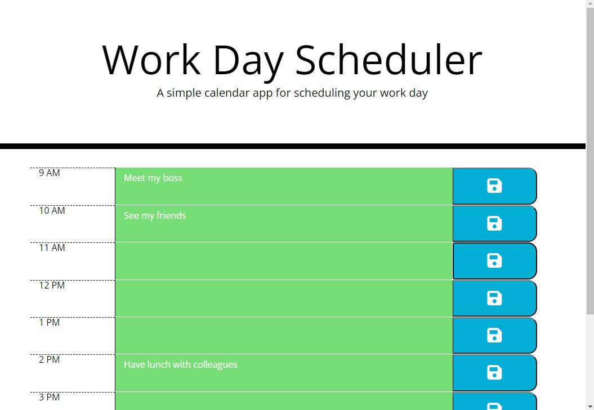

# Day Planner

  

## Introduction

Managers and engineers often struggle to organise their daily tasks. This app's design is geared towards a daily set of tasks. I wanted to create an app that dynamically updated HTML and CSS elements using jQuery and Bootstrap.

While making this app, I learned about the importance of event delegation to make code look neater, as well as the convenience of client-side local storage.

## Usage

Deployed: [Work Day Scheduler](https://leoelicos.github.io/bcs-05-day-planner/). Will run on small and large screens.

## Screenshots

### Splash Page

## Credits

-  BCS Resources

## License

&copy; Leo Wong <leoelicos@gmail.com>

Licensed under the [MIT License](./LICENSE).
