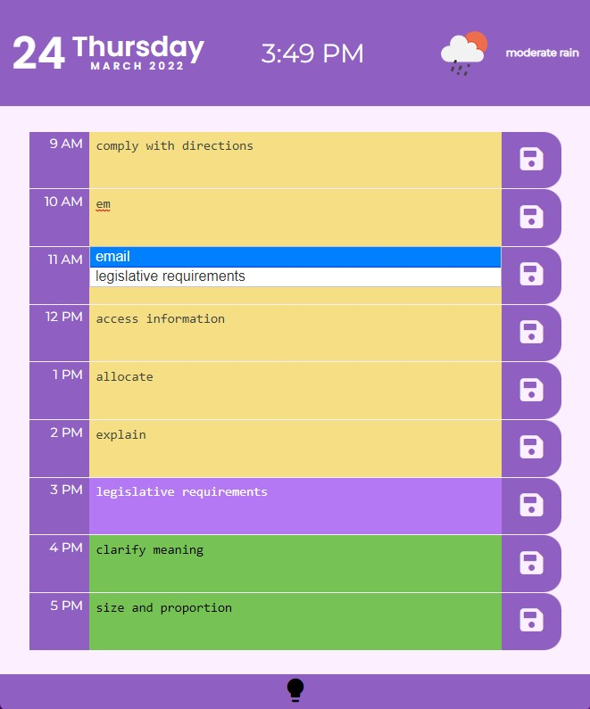

# Day Planner

  

## Introduction

Managers and engineers often struggle to organise their daily tasks. This app's design is geared towards a daily set of tasks. I wanted to create an app that dynamically updated HTML and CSS elements using jQuery.

While making this app, I learned about the importance of event delegation to make code look neater, as well as the convenience of client-side local storage and server-side APIs.

### Third-Party APIs

-  The app uses [moment.js](https://momentjs.com/) to get the current time and use this information to render a clock
-  The app uses [jQuery UI Autocomplete](https://jqueryui.com/autocomplete/) to suggest a list of [business vocabulary from Indeed.com](https://www.indeed.com/career-advice/career-development/business-vocabulary)

### Server-side APIs

-  The app uses [ipregistry](https://ipregistry.co) to fetch the user's IP address via an API and uses this to read their location.
-  The app uses this information to query [OpenWeather](https://openweathermap.org/api) and get local weather

## Usage

Deployed: [Work Day Scheduler](https://leoelicos.github.io/bcs-05-day-planner/). Will run on small and large screens.

## Screenshots

### Light Mode, with Autocomplete UI

### Dark Mode

### Wide Mode

### Narrow Mode

## Credits

-  BCS Resources
-  [ipregistry](ipregistry.co)
-  [OpenWeather](https://openweathermap.org/api)

## License

&copy; Leo Wong <leoelicos@gmail.com>

Licensed under the [MIT License](./LICENSE).
